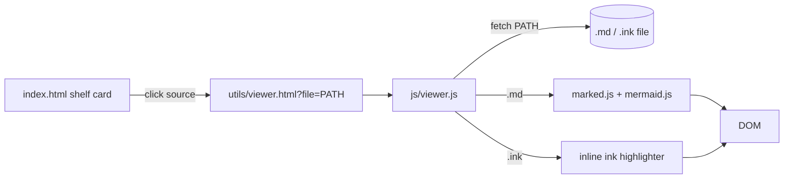

# md/ink viewer page

## Goal

When a user clicks a source link on the shelf that points to a `.md` or `.ink` file, open a styled viewer page (matching the aged-paper theme) instead of the browser's raw view.

- `.md` -> rendered Markdown + Mermaid diagrams
- `.ink` / `.twee` -> monospace text with light syntax highlighting (knots, choices, vars, comments)
- A "Back to shelf" link at the top

## Architecture



## Files to add

### 1. `utils/viewer.html` (implemented)

A minimal page mirroring `index.html` styling. Loads:

- `../css/main.css` (shared theme)
- `../css/viewer.css` (prose + code styles)
- `marked` and `mermaid` from a CDN (only used when the file is `.md`)
- `../js/viewer.js`

Structure:

```html
<header class="site-header">
  <h1 class="site-title">Source Viewer</h1>
  <p><a href="../index.html">&larr; Back to shelf</a></p>
  <p id="viewer-filename" class="site-tagline"></p>
</header>
<main class="site-main">
  <article id="viewer-mount" class="viewer"></article>
</main>
```

### 2. `js/viewer.js` (new)

Responsibilities:

- Read `file` query param; reject anything containing `://`, `..`, or starting with `/` (only same-repo relative paths allowed).
- `fetch('../' + path)` and read as text (viewer lives under `utils/`).
- Decide by extension:
  - `.md` / `.markdown` -> `marked.parse(text)` into `#viewer-mount`, then call `mermaid.run({ querySelector: '.language-mermaid' })` (configure marked so ` ```mermaid ` blocks become `<pre class="mermaid">` or post-process them).
  - `.ink` / `.twee` -> render as `<pre class="ink-code">` with `<span class="tok-...">` wrappers via a small highlighter (regex-based; see below).
  - anything else -> plain `<pre>` fallback.
- Set `document.title` and `#viewer-filename` to the file path.
- On fetch failure, render an error block with the path and status.

Minimal Ink highlighter rules (regex per line, applied in order):

- `^\s*//.*$` -> `tok-comment`
- `^\s*VAR\b.*$` -> `tok-var`
- `^\s*=== .* ===\s*$` -> `tok-knot` (also `== name ==`)
- `^\s*= \w+` -> `tok-stitch`
- `^\s*->.*$` and `<-` -> `tok-divert`
- `^\s*[*+]+ .*$` -> `tok-choice`
- `^\s*-\s.*$` -> `tok-gather`
- `\{[^}]*\}` -> `tok-logic`

Keep it simple; one pass per line is enough for this site.

### 3. `css/viewer.css` (new)

- `.viewer` -> max-width column, paper background, body font from `--font-body`.
- Style `h1..h4`, `p`, `ul`, `ol`, `table`, `code`, `pre`, `blockquote` to match the aged-paper theme.
- `.ink-code` and tokens:
  - `tok-knot` bold + accent color
  - `tok-choice` accent
  - `tok-var` italic
  - `tok-comment` muted
  - `tok-divert`, `tok-stitch`, `tok-logic` distinct hues from existing tokens.
- Mermaid container gets a paper-tinted background and border.

## Files to change

### 4. [js/shelf.js](js/shelf.js)

In `createSourcesSection` (around the link creation, lines 48-63), rewrite the href for local `.md`/`.ink` files to go through the viewer:

```js
function viewerHref(href) {
  if (isExternalHref(href)) return href;
  if (/\.(md|markdown|ink|twee)$/i.test(href)) {
    return "utils/viewer.html?file=" + encodeURIComponent(href);
  }
  return href;
}
// ...
a.href = viewerHref(href);
```

This is the only change needed in the shelf; existing entries in [js/games.js](js/games.js) (`Ink/royal-makeover/README.md`, `Ink/royal-makeover/royal-makeover.ink`) will automatically route through the viewer.

## Out of scope

- No build step; everything is plain static files loaded via CDN, consistent with the current site.
- No editing/saving of files; viewer is read-only.

## Validation steps

1. Open `index.html`, click "Flow Chart" on the Royal Makeover card -> viewer renders the README with the Mermaid flowchart visible.
2. Click "Ink file format" -> viewer shows the `.ink` text with knots / choices / vars colorized and a back link.
3. Twine `.twee` source links open in the viewer with the same highlighter as `.ink`.
4. External links (Twinery, Inkle, Chapbook) still open as before.
5. Manually load `utils/viewer.html?file=does/not/exist.md` -> shows an inline error, not a blank page.
