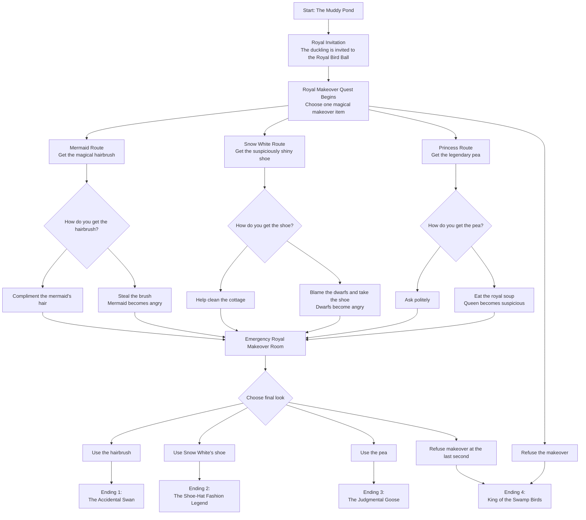

# The Ugly Duckling and the Emergency Royal Makeover

A short funny quest-style interactive story inspired by mixed fairy tales.  
The player is an ugly duckling invited to the Royal Bird Ball, but must become “fairy-tale appropriate” before entering.

## Story Flow Diagram



## Endings

| Ending | Trigger | Result |
|---|---|---|
| The Accidental Swan | Use the mermaid's hairbrush | The duckling becomes elegant, shiny, and confused. |
| The Shoe-Hat Fashion Legend | Use Snow White's shoe | The duckling accidentally creates the kingdom's newest fashion trend. |
| The Judgmental Goose | Use the legendary pea | The duckling transforms into a loud fashion-reviewing goose. |
| King of the Swamp Birds | Refuse the makeover | The duckling rejects royal beauty standards and starts a muddy party. |

## Suggested Ink Structure

```text
start
refuse_early
quest_start
mermaid_route
snow_white_route
princess_route
makeover_room
swan_ending
shoe_ending
goose_ending
swamp_king_ending
```
