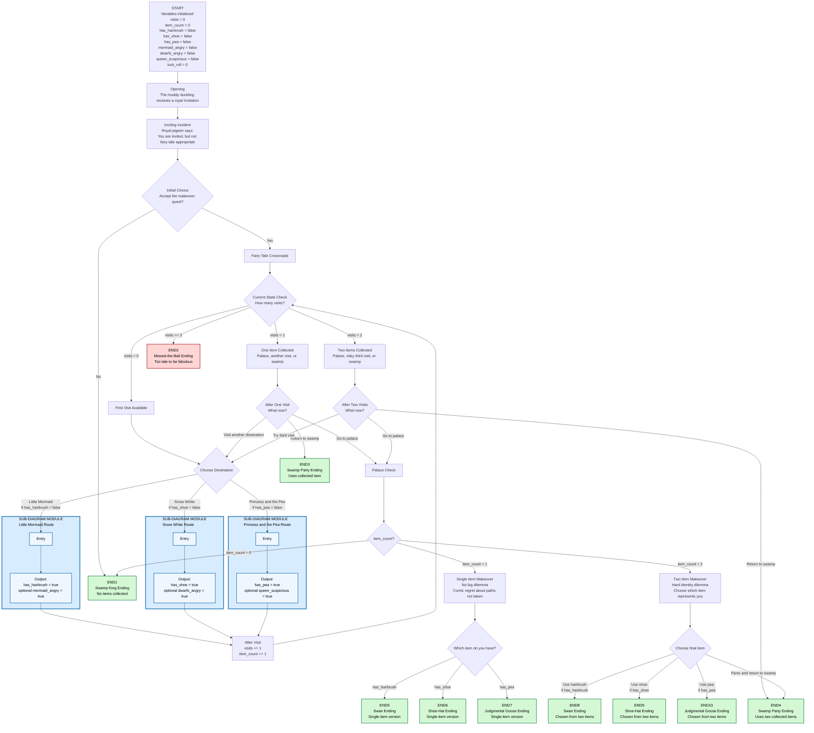
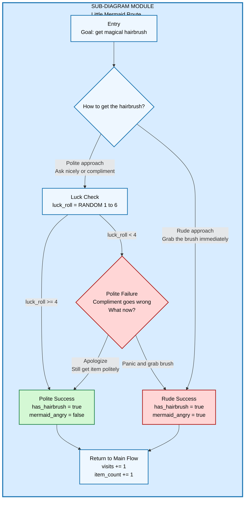
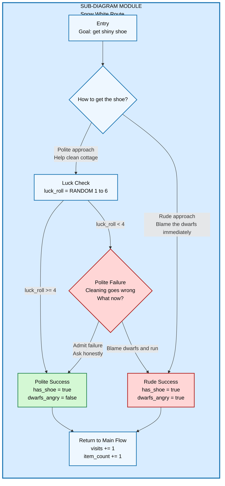
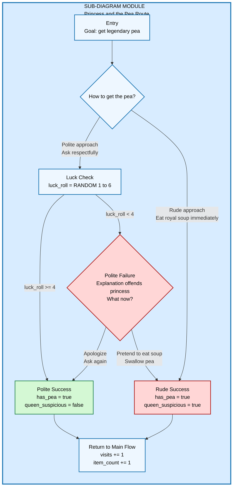

# The Ugly Duckling and the Fairy-Tale Mess

A short, funny, quest-style interactive story written in **Ink**, inspired by mixed fairy tales and parody fantasy humor.

The player controls an ugly duckling who is invited to the **Royal Bird Ball**, but there is one problem: according to the royal pigeon, he is not yet “fairy-tale appropriate.”

To enter the ball, the duckling may visit fairy-tale characters and collect magical makeover items. Each visit costs time. The player can go to the palace early, keep searching, return to the swamp, or risk missing the ball entirely.

## Inspirations

This story is loosely inspired by classic fairy-tale motifs:

- [The Ugly Duckling](https://en.wikipedia.org/wiki/The_Ugly_Duckling)
- [The Little Mermaid](https://en.wikipedia.org/wiki/The_Little_Mermaid)
- [Snow White](https://en.wikipedia.org/wiki/Snow_White)
- [The Princess and the Pea](https://en.wikipedia.org/wiki/The_Princess_and_the_Pea)

The tone is intended to be humorous, playful, and slightly absurd, similar to fairy-tale parody films such as *Shrek*, while using original characters and situations.

## Core Game Mechanic

The story combines branching narrative with a light procedural structure:

1. The player can visit up to three fairy-tale locations.
2. Each visit increases `visits` and `item_count`.
3. Visiting one or two locations keeps the player in time for the ball.
4. Visiting all three locations causes the player to miss the ball.
5. Each route gives the player a choice:
   - A polite approach with a luck check.
   - A rude approach that always gets the item but creates a comic consequence.
6. Endings react to both the chosen item and the way it was obtained.

## Variables

| Variable | Purpose |
|---|---|
| `visits` | Counts how many fairy-tale locations the player has visited. |
| `item_count` | Counts how many makeover items the player collected. |
| `has_hairbrush` | Tracks whether the player collected the Little Mermaid’s magical hairbrush. |
| `has_shoe` | Tracks whether the player collected Snow White’s shiny shoe. |
| `has_pea` | Tracks whether the player collected the legendary pea. |
| `mermaid_angry` | Tracks whether the Little Mermaid is angry because the player took the hairbrush rudely. |
| `dwarfs_angry` | Tracks whether the dwarfs are angry because the player blamed them. |
| `queen_suspicious` | Tracks whether the Queen suspects the player ate the royal pea. |
| `luck_roll` | Stores the result of a random luck check from 1 to 6. |

## Diagram Color Legend

| Color | Meaning |
|---|---|
| Blue | Sub-diagram module or route structure. |
| Green | Good or polite outcome. |
| Red | Bad, rude, chaotic, or not-so-good outcome. |

---

# Story Flow Diagram

---

# Sub-Diagram 1 — Little Mermaid Route

The Little Mermaid route gives the player a chance to obtain the magical hairbrush. A polite approach depends on luck, while the rude approach always succeeds but makes the Mermaid angry.

---

# Sub-Diagram 2 — Snow White Route

The Snow White route gives the player a chance to obtain the shiny shoe. A polite approach means helping with the cottage, while the rude approach blames the dwarfs and creates trouble.

---

# Sub-Diagram 3 — Princess and the Pea Route

The Princess and the Pea route gives the player a chance to obtain the legendary pea. A polite approach depends on explaining the request respectfully, while the rude approach involves eating the royal soup and swallowing the pea.

---

# Ending Summary

| Ending | Trigger | Tone |
|---|---|---|
| END1 — Swamp King Ending | Refuse the quest immediately or arrive with no items. | Good / self-acceptance |
| END2 — Missed-the-Ball Ending | Visit all three locations before going to the palace. | Not-so-good / comic failure |
| END3 — Swamp Party Ending | Return to the swamp after one item. | Good / comic alternative |
| END4 — Swamp Party Ending | Return to the swamp after two items, or panic in the makeover room. | Good / comic alternative |
| END5 — Swan Ending | Use the hairbrush after collecting only one item. | Good |
| END6 — Shoe-Hat Ending | Use the shoe after collecting only one item. | Good |
| END7 — Judgmental Goose Ending | Use the pea after collecting only one item. | Good |
| END8 — Swan Ending | Choose the hairbrush after collecting two items. | Good / stronger dilemma payoff |
| END9 — Shoe-Hat Ending | Choose the shoe after collecting two items. | Good / stronger dilemma payoff |
| END10 — Judgmental Goose Ending | Choose the pea after collecting two items. | Good / stronger dilemma payoff |

## Design Note

The main dramatic question of the story is:

> Will the ugly duckling become “fairy-tale appropriate” according to royal standards, or will he define his own kind of fabulous?

The endings should keep the comedy light and playful. Even the “bad” ending is not tragic; it is a funny consequence of trying to complete too many side quests before the main event.
